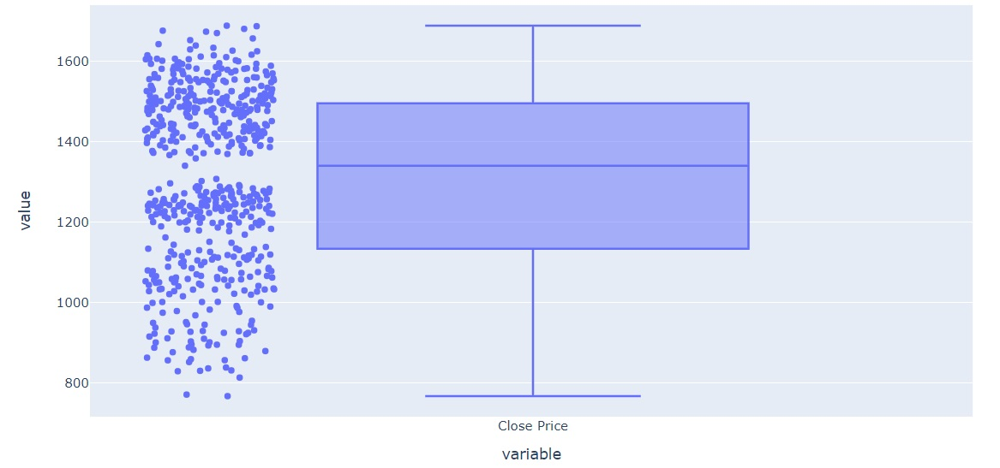

# StockBestFit
StockBestFit is an application which analayses a set of models for a given dataset and outputs best fit for the data set.

## Problem Statement
“Stock market is a complex and challenging system where people will 
either gain money or lose their entire life savings, We are trying to come 
up with the best model which has better accuracy for the HDFC Bank 
share price"

## Approach

## Data Preprocessing

* Data Mining
* Data Cleaning
    * outlier detection
    
    * removal of anonymous data
    

## Data Analysis

* Line chart

  

## Base models

* Naive Forecast
     * Naive forecasting is the technique in which the last period's sales are used for the next period's forecast without predictions or adjusting the factors.

* Simple Average
     * The simple average of a set of observations is computed as the sum of the individual observations divided by the number of observations in the set.

* Moving Average
     * In a simple moving average model, we forecast the next value(s) in a time series based on the average of a fixed finite number ‘p’ of the previous values.
      
* Simple exponential smoothing
     * In Simple exponential smoothing the forecasts are calculated using weighted averages where the weights decrease exponentially as observations come from further in the past, the smallest weights are associated with the oldest observations.
     
* Holt's linear trend
    * In Holt’s Linear Trend Method, it considers the trend. It is nothing more than exponential 
    smoothing applied to both level (the average value in the series) and trend.
    
* Holt winter's method
    * In Holt’s Winters Method, it considers all. It is nothing more than exponential smoothing 
    applied to all three level (the average value in the series), trend and season.
    

## Secondary models

* ARIMA
    * It stands for Autoregressive Integrated Moving Average. While exponential smoothing models were based on a description of trend and seasonality in the data, ARIMA model aim to describe the correlations in the data with each other.
    * Stationarity of the data was checked and appropriate measures were done to make data stationary.
    
* SARIMA
    * Seasonal Autoregressive Integrated Moving Average, SARIMA or Seasonal ARIMA, is an 
    extension of ARIMA that explicitly supports univariate time series data with a seasonal 
    component.
    
* FB Prophet
    * The Prophet library is an open-source library designed for making forecasts for univariate 
    time series datasets.

## Evaluating Root Mean Squared Error(RMSE) Value

## Deployment:
    * Deployment is the method by which you integrate a machine learning model into an existing 
    production environment to make practical business decisions based on data.
    * As the last stages of my Time Series project cycle, I have written a program to automate the buying and selling of stocks in the Trading View website using Selenium.
    