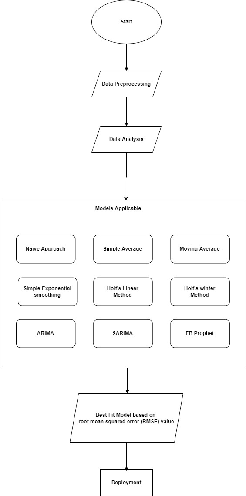

# StockBestFit
StockBestFit is an application which analayses a set of models for a given dataset and outputs best fit for the data set

## Problem Statement
“Stock market is a complex and challenging system where people will 
either gain money or lose their entire life savings, We are trying to come 
up with the best model which has better accuracy for the HDFC Bank 
share price"

## Approach

## Data Preprocessing

* Data Mining
* Data Cleaning
    * outlier detection
    * removal of anonymous data

## Data Analysis

Data Visualization using various charts namely

* Line chart

